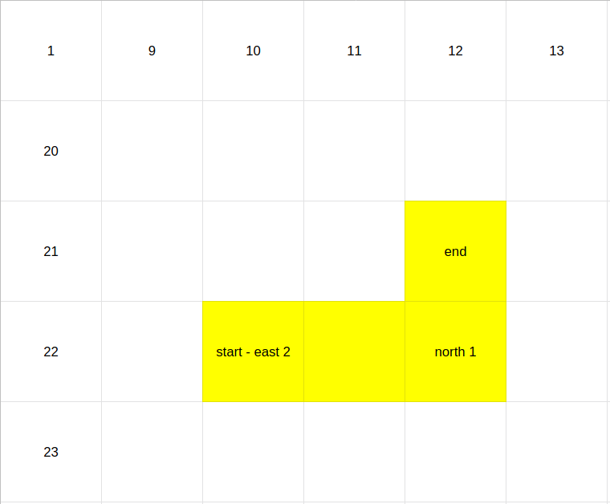

# Cleaning Robot Service

## About

> This service simulates a robot moving around a space.

Given this input:

```json
{
  "start": {
    "x": 10,
    "y": 22
  },
  "commands": [
    {
      "direction": "east",
      "steps": 2
    },
    {
      "direction": "north",
      "steps": 1
    }
  ]
}
```

The robot should move like this:



The robot covers 4 coordinates on its route.

## Assumptions

- `/tibber-developer-test/enter-path` surely means to replace `/enter-path` with an appropriate resource name? I decided the resource would be called "CommandRobot".

## Requirements

- Postgres 10.8
- DotNet 6.0

## Env vars

- `App__DatabaseConnectionString` - configure the Postgres connection string

## Docker

### Run dependencies

```
docker compose up -d postgres
```

### Running

This will also run any dependencies such as Postgres if you haven't already separately ran that service. You can comment out the `depends_on` section in the compose file if need be.

```
docker compose up runtime 
```

### Testing

```
docker compose up test 
```

## Migrations

Migrations are handled by EntityFramework.

### Creating new migrations

First install the tool (the config for local tools is stored in `.config/dotnet-tools.json`:

```
dotnet tool restore
```

To add a new migration:

```
dotnet ef migrations add MigrationName --project CleaningRobotService.Web --context ServiceDbContext
```

### Running migrations

Migrations are run by this service as it first starts up. This means when you release a code change which also requires a database change, these will be released at the same time.

If you have multiple instances of this service running at the same time, and they're released one by one, older versions of code may run into errors if the database is updated by another instance. When you're releasing, you need to be careful to either:

- ensure that migrations don't take too long to run (which would stop so many errors in production from occurring)
- or your database changes should not break existing code (this may require multiple releases of migrations)

## Design decisions

### Controllers and Services

Services should contain the actual business logic. Controllers are the interaction layer. This allows us to create different interaction layers such as a CLI which makes calls to the Services.

### Using EntityFramework

This ORM isn't the fastest ([being about twice as slow as Dapper](https://github.com/DapperLib/Dapper#performance)) but has some nice features:

- handles migrations
- no need to write SQL (and I love LINQ to SQL), so if your models update, the generated SQL updates too
- code is fairly agnostic about which db is really being used

Downsides:

- special features in specific databases can sometimes be hard to use

### Tests use a real instance of Postgres

While running database queries against a real instance of Postgres will somewhat slow down the tests, this is the best way to simulate real conditions in a unit test.

You can use an in memory database, but it doesn't act the same way as a real database.

https://learn.microsoft.com/en-us/ef/core/testing/#involving-the-database-or-not

> The in-memory provider will not behave like your real database in many important ways. Some features cannot be tested with it at all (e.g. transactions, raw SQL..), while other features may behave differently than your production database (e.g. case-sensitivity in queries). While in-memory can work for simple, constrained query scenarios, it is highly limited and we discourage its use.

### Separating out DTOs (data transfer objects) from database models

Example: CommandRobotDto and Execution

Both of these classes are almost identical, but they're separate because the API does not need to reflect how the database is built. It's possible that the API may need to change in the future to be different to how the database is structured, so may as well create different classes now to allow this.

Mapping between the DTOs and db models is manually done. AutoMapper could be used instead, but I'm not a fan of how AutoMapper magically does this, and this can cause runtime errors rather than issues being caught at compile time.

## If I had more time I would...

### Make the API more RESTful

I would make the CommandController store the Commands directly in the database. I would then have another controller where the Executions could be retrieved from.

Benefits:

- Commands can be replayed and Executions could be fixed (currently if there's a bug, there's no way to know which Commands were actually run).
- Executions could be run asynchronously. In the real world, the robot would move quite slowly so the task of it moving around could take a long time.

### Publish events to a queue

Since this service would likely be deployed to system of microservices, it could be that other services need to be aware of Executions, so I would publish them to a queue to other services could asynchronously consume any events.

I'd also add a Uuid column to the `executions` table which would be published instead of the integer ID.

### Fix global enum in API support

Internally enums should be used to reduce coding/spelling mistakes. Externally, we want strings to be sent to the API.

I used `[JsonConverter(typeof(JsonStringEnumConverter))]` on the `DirectionEum` to ensure strings are used in the API but this should be set globally.

- https://github.com/domaindrivendev/Swashbuckle.AspNetCore/issues/2293
- https://stackoverflow.com/questions/72034017/net-6-addjsonoptions-with-camelcase-not-working

### Implement auth

Right now, anyone can command the robot.

### Make use of transactions in db tests to ensure db remains clean between different tests?

Currently, each test which interacts with the database actually makes changes. This means if some tests ran in parallel, they could run into each other.

### Fix preciseness issue between Postgres and .NET

https://stackoverflow.com/questions/51103606/storing-datetime-in-postgresql-without-loosing-precision

### Decorate Swagger API with docs from XML

https://learn.microsoft.com/en-us/aspnet/core/tutorials/getting-started-with-swashbuckle?view=aspnetcore-6.0&tabs=visual-studio#xml-comments

### Ensure env vars are required

Running the application without properly setting up env vars can cause issues. This can happen quite often when a developer forgets to add new env vars to the production environment after testing a feature on a staging env and releasing. The application should fail to start if env vars are incorrectly configured. Systems like Kubernetes can also be configured to only take down older instances of services once the new instance has correctly started. This can avoid bad releases.

### Use Filters to create a consistent and useful error message when exceptions occur

https://learn.microsoft.com/en-us/aspnet/core/mvc/controllers/filters?view=aspnetcore-6.0

## Todo

- ~~make sure API is camelcase~~
- ~~make sure db is stored camel case~~
- ~~make sure enums are displayed in API as strings~~
- ~~put timing code in a different method~~
- ~~make direction code more dry (with lambda?)~~
- ~~double check that Point comparison really works like a value type~~
- ~~make sure all paths begin with tibber-developer-test~~
- ~~improve docs~~
- ~~test db~~
- ~~create dockerfile for building service~~
- test performance with larger dataset
- change CommandRobotService to only deal with the database and create an object which is the actual robot
